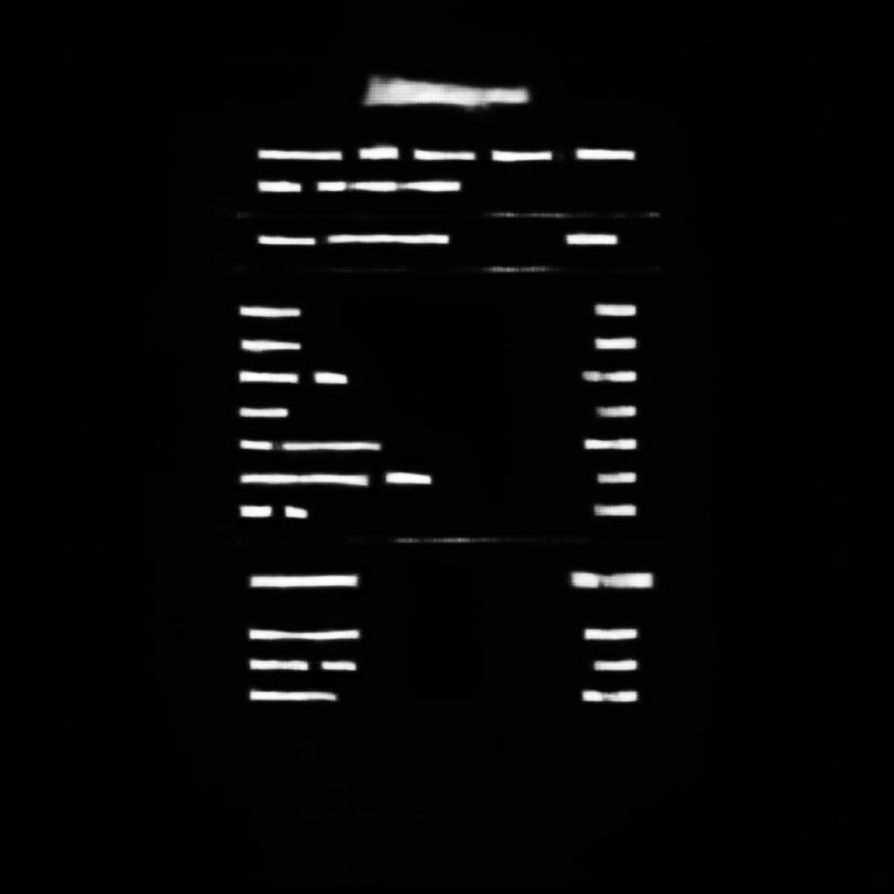

# Project Title
A pytorch re-implementation of Real-time Scene Text Detection with Differentiable Binarization : Updated model trained with 600 epochs and updated requirement.txt file.
[Source Link to repo](https://github.com/WenmuZhou/DBNet.pytorch

## Dataset 

[Click here to access the dataset](https://drive.google.com/drive/folders/1b8s2NZ4MEMj7Zig7kcWHy-yoi1gGeaHz?usp=sharing)

## Changes Made

### `requirement.txt`
- Updated dependencies to the latest versions.
- Added new libraries required for data processing and model training.

## Data Preparation

A new script has been added to the `datasets` directory to prepare data for training. This script handles data loading, preprocessing, and augmentation.

## Output



### Usage

To prepare your data for training, run the following script:

```sh
python datasets/prepare_data.py
